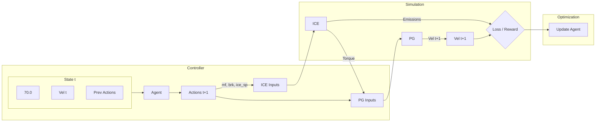

# Component-Level Data Flow Analysis

This document details the exact flow of data through the system, identifying every feature used as input or output for each component. The pipeline is identical for both the **Reinforcement Learning (RL)** and **Gradient-Based (GBM)** models, with minor differences only in how the Controller generates actions.

## 1. Pipeline Initialization (Source Data)

**Source**: `.csv` files in `src/data/` (e.g., `WLTP_Data.csv`)

The system initializes by picking a random row from a dataset to establish the starting physical state of the vehicle.

| CSV Column Name | Internal Variable | Unit | Purpose |
| :--- | :--- | :--- | :--- |
| `fuel` | `mf` | mg/stroke | Initial Fuel Mass Flow |
| `Brake` | `brk` | % (0-100) | Initial Brake Position |
| `ICE_Speed_soll` | `ice_sp` | RPM | Initial Engine Speed |
| `EM2_Torque` | `EM2` | Nm | **Used only for initial velocity calculation** |
| `ICE_Torque_pred` | `torque` | Nm | **Used only for initial velocity calculation** |

**Initial Calculation**:
Before the loop starts, the `PG Model` is called once with these values to determine the starting vehicle velocity ($v_0$).
$$ v_0 = \text{PG}(ice\_sp, EM2, torque, brk) $$

---

## 2. Component 1: The Controller (Agent)

The "Brain" of the system. It observes the current state and decides how to adjust the vehicle controls.

### **Input Features (State Vector)**
A vector of **5 continuous values** representing the system state at time $t$.

1.  **`vel_target`**: The desired reference speed (constant, e.g., $70.0$ km/h).
2.  **`vel_current`**: The actual vehicle speed at time $t$.
3.  **`mf`**: The fuel mass flow applied at previous step $t-1$.
4.  **`brk`**: The brake position applied at previous step $t-1$.
5.  **`ice_sp`**: The engine speed setpoint at previous step $t-1$.

### **Output Features (Action Vector)**
A vector of **3 continuous values** representing the new control commands.

1.  **`mf_new`**: New Fuel Mass Flow (mg/stroke).
2.  **`brk_new`**: New Brake Position (%).
3.  **`ice_sp_new`**: New Engine Speed Setpoint (RPM).

> **Note on Implementation Differences**:
> *   **RL (TD3)**: Outputs "deltas" or raw actions in $[-1, 1]$ which are scaled and added/applied to previous values.
> *   **GBM (LSTM)**: Outputs raw values which are passed through Sigmoid functions and scaled to physical ranges (e.g., 0-4500 RPM).

---

## 3. Component 2: Logic Gates (Safety/Physics)

Before sending actions to the physics constants/models, hard-coded logic modifies the values.

**Logic**: If Engine Speed (`ice_sp_new`) < 900 RPM:
*   **`torque`** $\rightarrow$ Forced to `0.0`.
*   **`mf`** $\rightarrow$ Forced to `0.0` (or minimal idle value).

---

## 4. Component 3: ICE Model (Internal Combustion Engine)

A pre-trained LSTM that simulates the engine's physics.

### **Input Features**
1.  **`Speed_rpm`**: Current engine speed input (`ice_sp_new`).
2.  **`m_fuel_mg`**: Current fuel mass input (`mf_new`).
3.  **`T_amb_K`**: Ambient Temperature (Constant: $298.0$ K).
4.  **`p_amb_bar`**: Ambient Pressure (Constant: $1.0$ bar).

### **Output Features**
1.  **`Torque_Nm`**: The physical torque generated by the engine.
    *   *Constraint*: Clipped to range $[-50, 300]$ Nm.
2.  **`NO_out`**: Nitrogen Output Emissions.
3.  **`NO2_out`**: Nitrogen Dioxide Emissions.
4.  **`CO_out`**: Carbon Monoxide Emissions.
5.  **`CO2_out`**: Carbon Dioxide Emissions.

---

## 5. Component 4: PG Model (Powertrain / Planetary Gear)

A pre-trained LSTM that simulates the vehicle's movement dynamics.

### **Input Features**
1.  **`ICE_Speed_soll_rpm`**: Current engine speed (`ice_sp_new`).
2.  **`EM2_Torque_Nm`**: Electric Motor 2 Torque.
    *   **Crucial Detail**: In the training loop, this is **hard-coded to 0.0**. The agent does not control it, nor is it read from data (except at $t=0$).
3.  **`ICE_Torque_Nm`**: The `Torque_Nm` output from the **ICE Model**.
4.  **`Brake_perc`**: Current brake position (`brk_new`).

### **Output Features**
1.  **`Car_Speed_kmph`**: The new vehicle velocity ($v_{t+1}$).
    *   This becomes `vel_current` for the next time step.
2.  **`SOC`**: Battery State of Charge.
    *   Calculated but essentially unused in the current Reward/Loss function.

---

## 6. Optimization Calculation

Based on the outputs, the system calculates performance metrics.

**RL Reward**:
$$ R_t = 1.0 - \left( \frac{|70.0 - v_{t+1}|}{Error_{max}} \right)^2 $$

**GBM Loss**:
$$ L_t = \alpha(70.0 - v_{t+1})^2 + \beta(\text{NOx}) + \gamma(\text{CO}) $$

## Summary Flow Diagram

