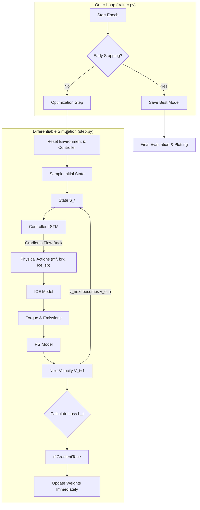

# Control Flow & Data Pipeline Analysis using Gradient Based Model (BPTT)

## 1. Validated File List

The following files in `gradient_based_model/` appear syntactically correct and form the core of the BPTT pipeline:

- **Entry Points**:
  - [gradient_based_model/main.py](file:///Users/niklaslongschiefelbein/local_documents/THESIS/code/rl_emission_reduction/controller_for_ICE_PG/gradient_based_model/main.py): Main execution script for training.
  - [gradient_based_model/main.ipynb](file:///Users/niklaslongschiefelbein/local_documents/THESIS/code/rl_emission_reduction/controller_for_ICE_PG/gradient_based_model/main.ipynb): Interactive notebook version.
- **Core Logic**:
  - [gradient_based_model/trainer.py](file:///Users/niklaslongschiefelbein/local_documents/THESIS/code/rl_emission_reduction/controller_for_ICE_PG/gradient_based_model/trainer.py): Orchestrates the training loop (Epochs, Early Stopping, Validation).
  - [gradient_based_model/step.py](file:///Users/niklaslongschiefelbein/local_documents/THESIS/code/rl_emission_reduction/controller_for_ICE_PG/gradient_based_model/step.py): Contains the **differentiable evaluation loop** ([rollout_and_loss](file:///Users/niklaslongschiefelbein/local_documents/THESIS/code/rl_emission_reduction/controller_for_ICE_PG/gradient_based_model/step.py#4-142)). This is the critical component where BPTT happens.
  - [gradient_based_model/models.py](file:///Users/niklaslongschiefelbein/local_documents/THESIS/code/rl_emission_reduction/controller_for_ICE_PG/gradient_based_model/models.py): Defines the [ScaledController](file:///Users/niklaslongschiefelbein/local_documents/THESIS/code/rl_emission_reduction/controller_for_ICE_PG/gradient_based_model/models.py#130-215) (LSTM-based Policy).
  - [gradient_based_model/transition_function_model.py](file:///Users/niklaslongschiefelbein/local_documents/THESIS/code/rl_emission_reduction/controller_for_ICE_PG/gradient_based_model/transition_function_model.py): Differentiable Simulator (ICE + PG LSTMs) compatible with `tf.GradientTape`.
  - [gradient_based_model/init_state.py](file:///Users/niklaslongschiefelbein/local_documents/THESIS/code/rl_emission_reduction/controller_for_ICE_PG/gradient_based_model/init_state.py): Functions to sample initial states from CSVs.
- **Evaluation**:
  - [gradient_based_model/eval.py](file:///Users/niklaslongschiefelbein/local_documents/THESIS/code/rl_emission_reduction/controller_for_ICE_PG/gradient_based_model/eval.py): Utilities for non-differentiable inference and plotting.

---

## 2. Control Flow Overview

Unlike the RL approach which uses a "buffer" and "offline" updates, this approach treats the **Action-Simulator** loop as a single giant Recurrent Neural Network (RNN) and optimizes it using standard Backpropagation Through Time (BPTT).

### **Phase 1: Initialization**

1.  **Start**: User runs [main.py](file:///Users/niklaslongschiefelbein/local_documents/THESIS/code/rl_emission_reduction/controller_for_ICE_PG/gradient_based_model/main.py).
2.  **Environment Setup**:
    - Loads pre-trained LSTM models ("ICE" and "PG") and wraps them in [transition_function_model](file:///Users/niklaslongschiefelbein/local_documents/THESIS/code/rl_emission_reduction/controller_for_ICE_PG/reinforcement_learning_model/transition_function_model.py#82-353).
3.  **Controller Setup**:
    - Initializes [ScaledController](file:///Users/niklaslongschiefelbein/local_documents/THESIS/code/rl_emission_reduction/controller_for_ICE_PG/gradient_based_model/models.py#130-215) (LSTM) with input/output scalers loaded from `../src/escalados/gbm_v1.lib`.
    - Performs a "Short Multi-start": Runs 3 short training sessions with different random seeds and picks the best one to avoid bad local minima.

### **Phase 2: Training Loop (Online BPTT)**

The `trainer.train_and_save_controller` manages the outer epoch loop, while `step.rollout_and_loss` manages the inner simulation loop.

**Inner Loop ([step.py](file:///Users/niklaslongschiefelbein/local_documents/THESIS/code/rl_emission_reduction/controller_for_ICE_PG/gradient_based_model/step.py)):**

1.  **Reset**: Validates component LSTMs and Controller states are zeroed.
2.  **Sample State**: [sample_init_state()](file:///Users/niklaslongschiefelbein/local_documents/THESIS/code/rl_emission_reduction/controller_for_ICE_PG/reinforcement_learning_model/environment.py#233-265) picks a random starting point.
3.  **Forward Pass (Time $t=0$ to $T$):**
    - **Input**: State tensor $[v_{target}, v_{curr}, \dot{m}_f, brk, \omega_{ice}]$.
    - **Controller**: Predicts raw actions $\rightarrow$ Applies constraints (Sigmoid/Tanh) $\rightarrow$ Physical Actions $[\dot{m}_f, brk, \omega_{ice}]$.
    - **Environment**:
      - [predict_ice](file:///Users/niklaslongschiefelbein/local_documents/THESIS/code/rl_emission_reduction/controller_for_ICE_PG/reinforcement_learning_model/transition_function_model.py#199-243): Actions $\rightarrow$ Torque + Emissions (NOx, CO).
      - [predict_PG](file:///Users/niklaslongschiefelbein/local_documents/THESIS/code/rl_emission_reduction/controller_for_ICE_PG/reinforcement_learning_model/transition_function_model.py#245-290): Torque + Brake $\rightarrow$ Next Velocity ($v_{next}$).
    - **Loss Calculation**: $L_t = \alpha(v_{target}-v_{next})^2 + \beta \text{NOx} + \gamma \text{CO}$.
    - **Backprop**: Gradients are calculated via `tf.GradientTape` and applied **immediately** (Online Learning).
    - **State Update**: $v_{curr} \leftarrow v_{next}$.

### **Phase 3: Hyperparameter Dynamics**

- **Warm-up Reduction**: The variable `warmup_steps` determines how many initial steps are ignored in the final loss calculation. As the model improves (`loss < good_loss`), this window is reduced, forcing the model to be stable earlier.
- **Learning Rate**: Reduced if loss plateaus (`ReduceLROnPlateau`).

---

## 3. Data Pipeline & Variables

### **A. Initial Inputs**

Data enters from `../src/data/` via [init_state.py](file:///Users/niklaslongschiefelbein/local_documents/THESIS/code/rl_emission_reduction/controller_for_ICE_PG/gradient_based_model/init_state.py).

- **Variables**: `fuel` (mf), `Brake` (brk), `ICE_Speed_soll` (ice_sp), `EM2_Torque` (EM2), `ICE_Torque_pred` (torque).

### **B. Differentiable Connections**

Crucially, all variables passed between the Controller and the Environment are **TensorFlow Tensors**. This maintains the computational graph for gradients.

- **Internal Scaling**: The [ScaledController](file:///Users/niklaslongschiefelbein/local_documents/THESIS/code/rl_emission_reduction/controller_for_ICE_PG/gradient_based_model/models.py#130-215) class ([models.py](file:///Users/niklaslongschiefelbein/local_documents/THESIS/code/rl_emission_reduction/controller_for_ICE_PG/gradient_based_model/models.py)) handles normalization internally. It receives raw scalar inputs and outputs raw physical actions.

### **C. Optimization Objective**

The Loss Function aims to minimize:
$$ L = \sum*{t} \left[ \alpha (v*{target} - v\_{t})^2 + \beta \cdot \text{NOx}\_t + \gamma \cdot \text{CO}\_t \right] $$

### **D. Outputs**

- **Model**: TF SavedModel in `models/<run_name>`.
- **Plots**: Loss curve (`loss.png`) and Interactive Trajectory (`traj_final.html`).

---

## 4. Visualized Control Loop (BPTT)

