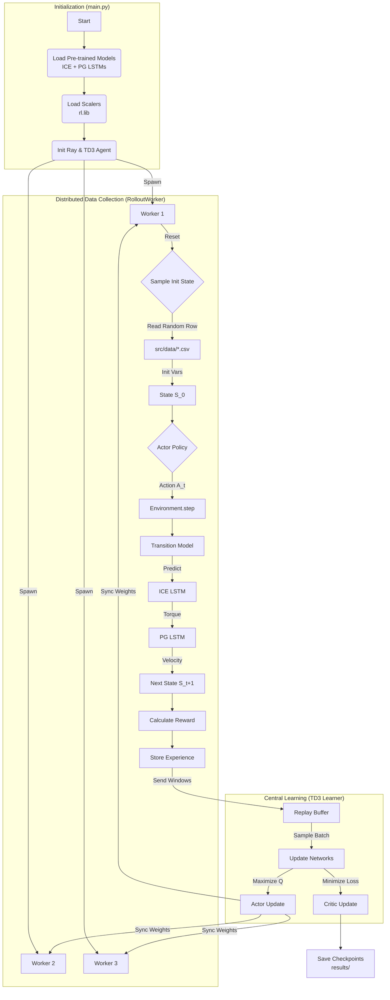

# Control Flow & Data Pipeline Analysis using Reinforcement Learning

## 1. Validated File List
The following files in `reinforcement_learning_model/` and `src/` have been analyzed and appear syntactically correct and functional for the RL pipeline:

*   **Entry Points**:
    *   [reinforcement_learning_model/main.py](file:///Users/niklaslongschiefelbein/local_documents/THESIS/code/rl_emission_reduction/controller_for_ICE_PG/reinforcement_learning_model/main.py): Main execution script.
    *   [reinforcement_learning_model/main.ipynb](file:///Users/niklaslongschiefelbein/local_documents/THESIS/code/rl_emission_reduction/controller_for_ICE_PG/reinforcement_learning_model/main.ipynb): Interactive notebook version.
*   **Core Logic**:
    *   [reinforcement_learning_model/TD3_Ray.py](file:///Users/niklaslongschiefelbein/local_documents/THESIS/code/rl_emission_reduction/controller_for_ICE_PG/reinforcement_learning_model/TD3_Ray.py): Implementation of the TD3 Agent and RolloutWorkers (actors).
    *   [reinforcement_learning_model/environment.py](file:///Users/niklaslongschiefelbein/local_documents/THESIS/code/rl_emission_reduction/controller_for_ICE_PG/reinforcement_learning_model/environment.py): RL Environment wrapper (State/Action definitions).
    *   [reinforcement_learning_model/transition_function_model.py](file:///Users/niklaslongschiefelbein/local_documents/THESIS/code/rl_emission_reduction/controller_for_ICE_PG/reinforcement_learning_model/transition_function_model.py): Differentiable Simulator (ICE + PG LSTMs).
    *   [reinforcement_learning_model/ActorCriticNetworks.py](file:///Users/niklaslongschiefelbein/local_documents/THESIS/code/rl_emission_reduction/controller_for_ICE_PG/reinforcement_learning_model/ActorCriticNetworks.py): Neural network definitions for Actor and Critic.
    *   [reinforcement_learning_model/ReplayBuffer.py](file:///Users/niklaslongschiefelbein/local_documents/THESIS/code/rl_emission_reduction/controller_for_ICE_PG/reinforcement_learning_model/ReplayBuffer.py): Experience replay memory.
    *   [reinforcement_learning_model/Noise.py](file:///Users/niklaslongschiefelbein/local_documents/THESIS/code/rl_emission_reduction/controller_for_ICE_PG/reinforcement_learning_model/Noise.py): Gaussian noise for exploration.

---

## 2. Control Flow Overview

The system follows a typical Reinforcement Learning loop (Actor-Critic) accelerated with Ray for parallel data collection.

### **Phase 1: Initialization**
1.  **Start**: User runs [main.py](file:///Users/niklaslongschiefelbein/local_documents/THESIS/code/rl_emission_reduction/controller_for_ICE_PG/reinforcement_learning_model/main.py).
2.  **Environment Setup**:
    *   Loads pre-trained LSTM models ("ICE" and "PG") from `../src/models_markus/`.
    *   Loads `MinMaxScaler` objects from `../src/escalados/rl.lib`.
    *   Initializes [transition_function_model](file:///Users/niklaslongschiefelbein/local_documents/THESIS/code/rl_emission_reduction/controller_for_ICE_PG/reinforcement_learning_model/transition_function_model.py#82-353), which wraps these models into a differentiable environment simulator.
3.  **Agent Setup**:
    *   Initializes [TD3](file:///Users/niklaslongschiefelbein/local_documents/THESIS/code/rl_emission_reduction/controller_for_ICE_PG/reinforcement_learning_model/TD3_Ray.py#194-1096) (Learner) on the GPU.
    *   Spawns multiple [RolloutWorker](file:///Users/niklaslongschiefelbein/local_documents/THESIS/code/rl_emission_reduction/controller_for_ICE_PG/reinforcement_learning_model/TD3_Ray.py#39-192) actors (CPU) via Ray.
    *   Each Worker creates its own copy of the [Environment](file:///Users/niklaslongschiefelbein/local_documents/THESIS/code/rl_emission_reduction/controller_for_ICE_PG/reinforcement_learning_model/environment.py#11-265).

### **Phase 2: Asynchronous Training Loop**
The `TD3.learn()` method orchestrates the following parallel processes:

*   **RolloutWorkers (Data Collection)**:
    1.  Reset environment: `Environment.sample_init_state()` picks a random row from `src/data/*.csv`.
    2.  **Loop**:
        *   Observe state $S_t$.
        *   Select action $A_t$ using local Actor network + Noise.
        *   Step environment: $S_{t+1}, R_t$ = `transition_function_model.predict(...)`.
        *   Store tuple $(S_t, A_t, R_t, S_{t+1})$.
    3.  Send collected "windows" of experience back to the Learner.

*   **Learner (Training)**:
    1.  Receives experience windows and adds them to [ReplayBuffer](file:///Users/niklaslongschiefelbein/local_documents/THESIS/code/rl_emission_reduction/controller_for_ICE_PG/reinforcement_learning_model/ReplayBuffer.py#5-127).
    2.  Samples a batch of experiences.
    3.  **Update Critic**: Minimizes error between predicted Q-value and target Q-value (Bellman equation).
    4.  **Update Actor**: Maximizes the Q-value estimated by the Critic.
    5.  **Sync**: Periodically sends updated Actor weights to RolloutWorkers.

---

## 3. Data Pipeline & Variables

### **A. Initial Inputs (Source of Truth)**
Data enters the system from CSV files located in `../src/data/`.
*   **Method**: `Environment.sample_init_state`
*   **Variables Read**:
    *   `fuel` $\rightarrow$ Initial Mass Fuel (`mf`)
    *   `Brake` $\rightarrow$ Initial Brake (`brk`)
    *   `ICE_Speed_soll` $\rightarrow$ Engine Speed Setpoint (`ice_sp`)
    *   `EM2_Torque` $\rightarrow$ Electric Motor Torque (`EM2`)
    *   `ICE_Torque_pred` $\rightarrow$ Predicted Torque (`torque`)

### **B. State & Action Space**
These define the interface between the Agent and the System.

| Type | Variable | Description | Source |
| :--- | :--- | :--- | :--- |
| **State** $(S_t)$ | `vel_target` | Desired velocity (e.g., 70 km/h) | Config / Constant |
| | `vel` | Current vehicle velocity | `PG_Model` Output |
| | `mf` | Fuel mass flow | Previous Action |
| | `brk` | Brake position | Previous Action |
| | `ice_sp` | Engine speed setpoint | Previous Action |
| **Action** $(A_t)$ | `delta_mf` | Change in fuel flow | Actor Network Output |
| | `delta_brk` | Change in brake position | Actor Network Output |
| | `delta_ice_sp` | Change in engine speed | Actor Network Output |

### **C. Reward Signal (Optimization Objective)**
The agent optimizes for **Velocity Tracking**.
*   **Formula**: $R = 1.0 - (\text{NormalizedError})^2$
*   **Where**: $\text{Error} = |V_{target} - V_{actual}|$

### **D. Outputs**
*   **Trained Weights**: `results/<version>/actor_final.pth`
*   **Execution Logs**: Terminal output (Win rates, Reward averages).
*   **Plots**: `results/<version>/trag_<version>.html` (Interactive trajectory plots).

---

## 4. Visualized Control Loop

